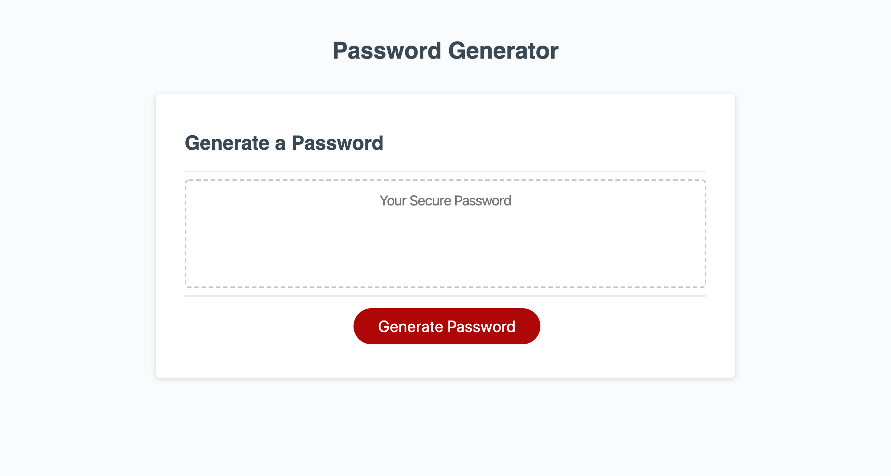

# Homework 3: JavaScript Password Generator

## Objectives

Create a password generator that prompts a user to choose how many characters and what kind of characters they would like included in their password (special characters, numbers, lowercase letters, and/or uppercase letters). The password generator will then give a random password with the indicated length and chosen characters when the "generate password" button is clicked on. 

## Screenshot

## Link to Deployed Page

[Here is a link to the deployed page.](https://erikaosterbur.github.io/javascript-password-generator/)